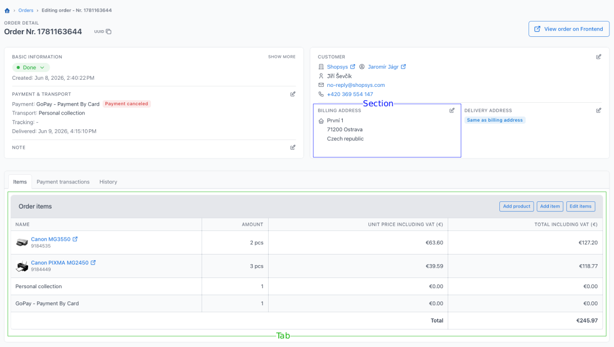

# Extending Order Detail Page

[TOC]

This cookbook describes how to extend the administration order detail page with new features.
The order detail page is split into editable sections and lazy-loaded tabs:

- sections are small editable parts of the order detail and are rendered with the `OrderDetail:Section` component (blue box in the screenshot below)
- tabs are larger page parts rendered through a registered component; inactive tabs are loaded lazily when opened (green box in the screenshot below)



## Adding a new form field into an existing section

Editable order detail sections reuse the existing `OrderFormType`.
Add new fields through a Symfony form extension in your application, not by editing the package form type directly.

This example adds a `deliveryInstructions` field into the personal data section.
It assumes the corresponding order data property is already added and saved by your project model extension.
For entity and data object extension, see [Adding new attribute to an entity](./adding-new-attribute-to-an-entity.md).

Create `app/src/Form/Admin/OrderFormTypeExtension.php`:

```php
<?php

declare(strict_types=1);

namespace App\Form\Admin;

use Override;
use Shopsys\FrameworkBundle\Form\Admin\Order\OrderFormType;
use Symfony\Component\Form\AbstractTypeExtension;
use Symfony\Component\Form\Extension\Core\Type\TextType;
use Symfony\Component\Form\FormBuilderInterface;

final class OrderFormTypeExtension extends AbstractTypeExtension
{
    /**
     * {@inheritdoc}
     */
    #[Override]
    public function buildForm(FormBuilderInterface $builder, array $options): void
    {
        $builder
            ->get('personalDataGroup')
            ->add('deliveryInstructions', TextType::class, [
                'required' => false,
                'label' => t('Delivery instructions'),
            ]);
    }

    /**
     * {@inheritdoc}
     */
    #[Override]
    public static function getExtendedTypes(): iterable
    {
        yield OrderFormType::class;
    }
}
```

Then render the field in the matching section form template.
For example, override the existing personal section form template and extend the original administration template with `@!ShopsysAdministration`:

```text
app/templates/bundles/ShopsysAdministrationBundle/content/order/detail/sections/personal_form.html.twig
```

For simple additions, append the field in the existing `section_content` block:

```twig



    {{ parent() }}
    {{ form_row(form.personalDataGroup.deliveryInstructions) }}

```

Use a full template copy only when you need exact placement that the available blocks do not allow.

To display the value in the section preview, override only the prepared Twig block in the matching view template.
For the personal data section, override the existing personal section view template:

```text
app/templates/bundles/ShopsysAdministrationBundle/content/order/detail/sections/personal_view.html.twig
```

and extend the original administration template with `@!ShopsysAdministration`.

```twig



    {{ parent() }}

    
        <div class="text-secondary">
            <strong>{{ 'Delivery instructions'|trans }}:</strong>
            {{ order.deliveryInstructions }}
        </div>
    

```

Use a full template copy only when no prepared block fits the place where you need to render the new value.

## Creating and rendering a new section

A section definition provides:

- section ID
- view template
- form template
- modal title
- success flash message
- optional modal dialog CSS class

Section IDs must be alphanumeric because the section registry validates registered section IDs.

Create a provider in `app/src/Component/OrderDetail/OrderDetailSectionProvider.php`:

```php
<?php

declare(strict_types=1);

namespace App\Component\OrderDetail;

use Override;
use Shopsys\AdministrationBundle\Component\OrderDetail\OrderDetailSection;
use Shopsys\AdministrationBundle\Component\OrderDetail\OrderDetailSectionProviderInterface;

final class OrderDetailSectionProvider implements OrderDetailSectionProviderInterface
{
    /**
     * @return iterable<\Shopsys\AdministrationBundle\Component\OrderDetail\OrderDetailSection>
     */
    #[Override]
    public function getSections(): iterable
    {
        yield new OrderDetailSection(
            'internalNote',
            'Admin/Content/Order/Detail/Sections/internal_note_view.html.twig',
            'Admin/Content/Order/Detail/Sections/internal_note_form.html.twig',
            t('Edit internal note'),
            t('Internal note saved.'),
        );
    }
}
```

Providers implementing `OrderDetailSectionProviderInterface` are tagged automatically by service autoconfiguration.

Create the project-owned view template:

```twig
{# app/templates/Admin/Content/Order/Detail/Sections/internal_note_view.html.twig #}

<div class="subheader d-flex justify-content-between align-items-center mb-1">
    {{ 'Internal note'|trans }}
    {{ component('OrderDetail:SectionEditButton', {
        section: section,
        canEdit: canEdit,
    }) }}
</div>


    <div class="text-secondary">{{ order.internalNote }}</div>

```

Create the form template:

```twig
{# app/templates/Admin/Content/Order/Detail/Sections/internal_note_form.html.twig #}

{{ form_row(form.noteGroup.internalNote) }}
```

The form field itself still has to be added to `OrderFormType` through a form extension.
For this example, add it to the `noteGroup` after importing `Symfony\Component\Form\Extension\Core\Type\TextareaType`:

```php
$builder
    ->get('noteGroup')
    ->add('internalNote', TextareaType::class, [
        'required' => false,
        'label' => t('Internal note'),
    ]);
```

Registering a section does not render it anywhere automatically.
Render it in the template where it should appear, for example in an overridden summary bar template:

```twig
{{ component('OrderDetail:Section', {
    order: order,
    sectionId: 'internalNote',
}) }}
```

The `OrderDetail:Section` component passes these variables to the view template:

- `order`
- `section`
- `canEdit`
- any extra values from the optional `context` argument

The `context` option is useful only when the view template needs extra data that is not available on the order.
For example, the built-in withdrawal tab passes `withdrawalRequest` through `context` to the withdrawal section view.

## Creating a new tab

Order detail tabs are registered through `OrderDetailTabProviderInterface`.
Each tab points to a component name.
The order detail page passes `orderId` to the component and lazy-loads inactive tabs through the existing Ajax endpoint.

Create a tab component:

```php
<?php

declare(strict_types=1);

namespace App\Component\OrderDetail\LiveComponent;

use App\Model\Order\Order;
use App\Model\Order\OrderFacade;
use Symfony\UX\LiveComponent\Attribute\AsLiveComponent;
use Symfony\UX\LiveComponent\Attribute\LiveProp;
use Symfony\UX\LiveComponent\DefaultActionTrait;

#[AsLiveComponent(
    name: self::COMPONENT_NAME,
    template: 'Admin/Content/Order/Detail/packing_tab.html.twig',
)]
final class PackingTabComponent
{
    use DefaultActionTrait;

    public const string COMPONENT_NAME = 'OrderDetail:PackingTab';

    #[LiveProp]
    public int $orderId;

    public function __construct(
        private readonly OrderFacade $orderFacade,
    ) {
    }

    public function getOrder(): Order
    {
        return $this->orderFacade->getById($this->orderId);
    }
}
```

Create the component template:

```twig
{# app/templates/Admin/Content/Order/Detail/packing_tab.html.twig #}



<div {{ attributes }}>
    <h3 class="card-title mb-3">{{ 'Packing'|trans }}</h3>

    <div class="text-secondary">
        {{ 'Order Nr.'|trans }} {{ order.number }}
    </div>
</div>
```

Register the tab with a provider:

```php
<?php

declare(strict_types=1);

namespace App\Component\OrderDetail;

use App\Component\OrderDetail\LiveComponent\PackingTabComponent;
use App\Model\Order\Order;
use Override;
use Shopsys\AdministrationBundle\Component\OrderDetail\OrderDetailTab;
use Shopsys\AdministrationBundle\Component\OrderDetail\OrderDetailTabProviderInterface;

final class OrderDetailTabProvider implements OrderDetailTabProviderInterface
{
    /**
     * @return iterable<\Shopsys\AdministrationBundle\Component\OrderDetail\OrderDetailTab>
     */
    #[Override]
    public function getTabs(): iterable
    {
        yield new OrderDetailTab(
            'packing',
            t('Packing'),
            PackingTabComponent::COMPONENT_NAME,
            50,
            disabledWhen: static fn (Order $order): bool => $order->isDeleted(),
        );
    }
}
```

Providers implementing `OrderDetailTabProviderInterface` are tagged automatically by service autoconfiguration.

The tab constructor arguments are:

- `id` - used in the tab DOM ID and URL
- `label` - displayed in the tab header
- `componentName` - rendered component name
- `position` - lower numbers are displayed first
- `disabledWhen` - disabled tabs are visible but not loaded
- `visibleWhen` - hidden tabs are not displayed

Use `visibleWhen` when the tab should not exist for a given order, and `disabledWhen` when administrators should see the tab but cannot open it for the current order state.
The selected tab is stored in the `activeTab` query parameter, so the same tab stays selected after refresh.
