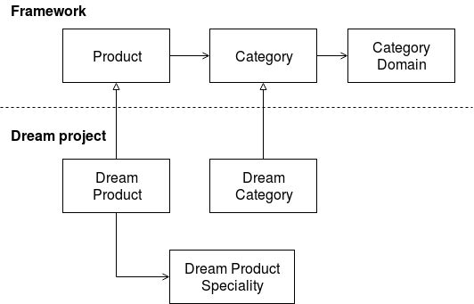

# Entity Extension

This article describes a quick way to extend your entity and the internals of the entity extension system implemented in Shopsys Platform.

## How can I extend an entity?

-   Create a new entity in your `src/Model` directory that extends the already existing framework entity
    -   some entities are already prepared out of the box
        -   `Administrator`
        -   `Article`
        -   `Brand`
        -   `Category`
        -   `Order`
        -   `OrderItem`
        -   `Payment`
        -   `Product`
        -   `Transport`
        -   `User`
    -   keep entity and table annotations
    -   you can add new properties and use annotations to configure ORM
-   Entities from namespace `App\` extending entities from namespace `Shopsys\` are automatically extended. If you want to extend from or to a different namespace, you need to add information about the entity extension into the container configuration
    -   add it to the configuration parameter `shopsys.entity_extension.map` placed in `config/parameters_common.yaml` file
    -   use the parent entity name as a key and the extended entity name as a value
    -   e.g., `MyVendor\MyLibrary\Model\Entity: App\Model\ExtendedEntity`
-   Create a new data object in your `src/Model` directory that extends already existing framework entity data
-   Create a factory for this entity data that extends the existing framework factory or implements the factory interface from the framework
    -   Rewrite Symfony configuration for the interface to alias your factory
        -   e.g.

```yaml
Shopsys\FrameworkBundle\Model\Product\ProductDataFactoryInterface:
    alias: App\Model\Product\ProductDataFactory
```

-   Now your extended entity is automatically used instead of the parent entity:
    -   in hydrated Doctrine references
    -   in the EntityManager, Repositories and QueryBuilders
    -   in newly created entities
-   If you are running tests, update also `\Tests\App\Functional\EntityExtension\EntityExtensionTest`
    -   add your extended entity into `$entityExtensionMap` in the `setUp()` method

!!! tip

    To see how it works in practice, check out `\Tests\App\Functional\EntityExtension\EntityExtensionTest` that tests end-to-end extensibility of `Product`, `Category` and `OrderItem`.

## Limitations

### OrderItem

`OrderItem` is a bit of a unique entity because it is not created from `OrderItemData`. It is created from different sources, like from product itself.
All creations are done by [`Order`](https://github.com/shopsys/shopsys/blob/master/packages/framework/src/Model/Order/Order.php) entity only, where you can check that it really makes sense to not create the `OrderItem` from a data object.

If you need to extend the `OrderItem` by a new field, for example, an ID from an external system, you'll have to fill this field after the `Order` is created by a new public method on `Order` class.
And then, if you'll need to be able to edit this field from the administration, you'll have to override the `edit` method of the `Order` entity and solve setting this new field there.

The other way of data - from `OrderItem` to `OrderItemData` is standard.
So, if you extend `OrderItem` in a standard fashion, set a new field in the extended `OrderItemDataFactory`, then the `OrderItemData` object will contain the correct value from the `OrderItem` object.

Creating a new type of `OrderItem` is possible and does not cause problems because the new type is completely in your hands.

You can read about alternative solutions we considered and the reasons behind this approach in [Entity Extension vs. Entity Generation](entity-extension-vs-entity-generation.md).

## Introduction into entity extensibility

Let's suppose that we are implementing the Dream project as a clone of the [project-base repository](https://github.com/shopsys/project-base).
Dream project depends on the glass-box [framework repository](https://github.com/shopsys/framework).
The framework is, of course, independent of our Dream project.

Entities in the framework are full-featured themselves, and we want to extend them with our custom properties and associations.
We achieve this via inheritance:



The dream project in the example above has extended entities Category and Product.
An association with a custom entity, Dream Product Speciality was added to Product.
CategoryDomain was not extended. This means that the extended Dream Category is associated with the original CategoryDomain.

Doctrine allows us to have only the original entity or the extended entity in the whole system. Both are not possible.
So, everything has to be consistent for all associations, new objects, repositories, and query builders otherwise, Doctrine will fail.

## How does it work?

The solution is based on Doctrine event subscribers and metadata manipulation.

It is important that the **EntityExtensionParentMetadataCleanerEventSubscriber** runs first and the **EntityExtensionSubscriber** runs last.
Otherwise, a conflict with other subscribers modifying the metadata would occur.

The correct order of relevant Doctrine event subscribers:

-   EntityExtensionParentMetadataCleanerEventSubscriber
-   Gedmo subscribers (_from [gedmo/doctrine-extensions](https://github.com/gedmo/doctrine-extensions)_)
-   TranslatableListener (_from [prezent/doctrine-translatable](https://github.com/prezent/doctrine-translatable)_)
-   EntityExtensionSubscriber

`EntityManagerDecorator` is then responsible for using the extended entities instead of their parents in EntityManager, Repositories and QueryBuilders.

### EntityExtensionParentMetadataCleanerEventSubscriber

EntityExtensionSubscriber (which must be executed last) turns the parent entities into MappedSuperclass.
It is better for the parent entities to be turned into MappedSuperclass before any other metadata manipulation is done.
Along with this, it strips all metadata from the parent entities.
This is basically to avoid other event subscribers to consider the parent entities to be real hydratable entities.
The only real problem we encountered was Gedmo's TreeListener which is used for nested trees of Category entities.

This event subscriber also clears metadata about inheritance from parent entities because,
in Doctrine, a MappedSuperclass entity cannot also be a root entity of true mapped inheritance.

### EntityExtensionSubscriber

This is the subscriber that extends entities.
It turns the parent entities into MappedSuperclass and adds parents' metadata into the extended entities.
Also, it replaces all associations with parent entities by extended entities.
It must have low priority, so it runs after Gedmo and Prezent extensions.
Gedmo and Prezent add their own mapping. Entity extension must be performed after all metadata are known.

### EntityManagerDecorator

The original `EntityManager` is decorated to use `EntityNameResolver` to resolve extended entities in relevant methods.
Using inheritance for this purpose was specifically discouraged in the original class annotation.
Decoration of this class requires the use of `EntitiyManagerInterface` as a type-hint instead of just `EntityManager` across the whole application.

It is also responsible for instantiating QueryBuilders and Repositories using the decorated EntityManager.

### EntityExtension\QueryBuilder

The original `QueryBuilder` is extended to use `EntityNameResolver` while adding new DQL parts.
The overridden method `add()` is used in all other relevant methods, such as `select()`, `from()`, `where()` etc.

### EntityNameResolver

The sole responsibility of this class is to resolve extended entity names in any variable that is provided using an entity extension map.
It replaces the parent entity name with the extended entity name in strings, arrays and object properties (even private ones using reflection).

The various capabilities of this resolver are best described in its unit test `\Tests\FrameworkBundle\Unit\Component\EntityExtension\EntityNameResolverTest`.

### Factories

Entities are created by factories. If any part of the framework creates an entity, it uses a factory.
So, in the project, we can change the factory to produce extended entities instead of the original, and the whole system will create extended entities.
We enforce using factories by our coding standard sniff [`ObjectIsCreatedByFactorySniff`](https://github.com/shopsys/shopsys/blob/master/packages/coding-standards/src/Sniffs/ObjectIsCreatedByFactorySniff.php).

The only exceptions are [translation entities](../model/entities.md#translation-entity) (named `*Translation`) and [domain entities](../model/entities.md#domain-entity) (named `*Domain`).
They are created by their owner entity.
If you need to extend the translation, you have to extend the owner entity as well and override the `createTranslation` method to produce the extended translation.
Similarly, if you need to extend the domain-specific part, you have to override the `createDomains` method.

### Data and DataFactories

Entity data are extended by inheritance.
Since they are not persisted, there is no need to do anything like in the case of entities.

Entity data are created by factories only.
These factories work in the same manner as the entity factories mentioned above.
If any part of the framework creates an entity data, it uses a factory.
So, in the project, we can change the factory to produce extended entity data instead of original and the whole system will create extended entity data.
