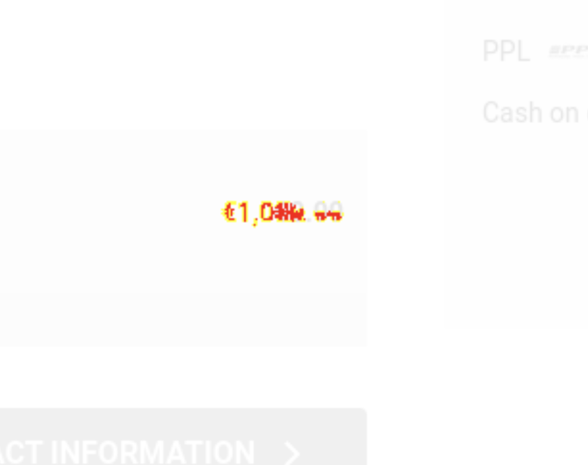
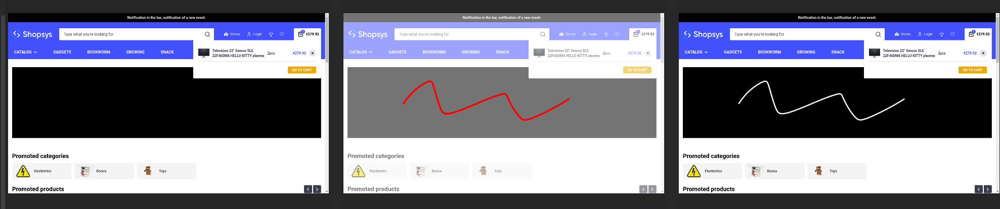

# Cypress

For E2E testing, we use [Cypress](https://www.cypress.io/). Below you can read answers to some of the questions you might have.

## How to structure your cypress folder?

### e2e folder

This folder is where you should put your test suites and domain-specific helpers. These would be things related to a single part of the application you are testing, such as helper which only focus on authentication, cart, or order.

You should split your tests into domain-specific subfolders. This helps to balance the tests and make it clear what each test suite focuses on. Some examples are the aforementioned authentication, cart, or order. Other examples could be adding to cart.

-   e2e/
    -   domainSpecificFunctionality/
        -   domainSpecificFunctionality.cy.ts
        -   domainSpecificFunctionalitySomeOtherPart.cy.ts
        -   domainSpecificFunctionalitySupport.ts

### fixtures folder

Here you can put any static values and demodata you would need. This could be strings to fill-in in inputs, things you would expect to find in a page, etc.

### support folder

Here you can put various global helpers, such as custom cypress commands, or similar. Because cypress only allows one support file, if you use multiple, you will have to import them as a whole into `/cypress/index.ts`.

You can put all commands or support functions related to API (such as manual mutations or queries) in `/support/api.ts`.

### TIDs.ts

Here you should put all data test IDs (TIDs) used in the app. Having them in a single TS file which can be globally referenced is helpful for maintenance and keeping track of used or unused IDs.

### cypress.d.ts

Here you should put type definitions for your custom cypress commands which are defined using `Cypress.Commands.add`. This is necessary as otherwise cypress cannot infer the types.

### snapshots folder

This is where all snapshots created using `takeSnapshotAndCompare` are stored. They are stored under the provided name (the title of the test plus the name provided as a function parameter).

### videos folder (uncommited)

This is where all videos from your tests are stored.

### screenshots folder (uncommited)

This is where all screenshots from your tests are stored. They are not the same as the snapshots, as these are generated even when running your tests in `base` mode. However, they can be used to compare your snapshots with the given test run. They are also the images based on which the snapshot diffs are generated (diffs between `snapshots` and `screenshots`).

### snapshotDiffs folder (uncommited)

This is where snapshot diffs are stored if a test fails because of visual regression. You have to keep in mind that even though only a single snapshot failing in a given test means that all diffs for that suite are saved. This results in potentially multiple _empty_ snapshot diffs. You should always check the cypress test logs to find out exactly which snapshot has failed.

## How to write tests?

### General guidelines

Your tests should ideally test a small and isolated part of the application. For example, it is better to split the order process into multiple steps (adding to cart, adding a promo code, choosing transport, choosing payment, filling in personal information) and test each of them separately, rather then as a whole. This is because to test all combinations (adding products from multiple places, choosing different transports, etc.) by testing the entire order, we would have to have a very large amount of tests, where many things would be repeated unnecessarily. However, if we split them and test all variants of a partial step, we test all combinations implicitly. Nevertheless, it is still helpful to write complex tests, especially as regression tests for some recurrent bugs.

To be more specific, you should group all tests for a specific part of the application in a single test suite using the `describe` method as seen below. Name it the same way your file is named.

Each test should be named in a way to describe what the test and the application should do. Below are some examples:

-   Should add a product to cart and check the cart
-   Should not be allowed to see transport options if cart is empty
-   Should login from header and then log out

In the `beforeEach` hook, you can run various preparation logic. There are also other hooks, which you can find in the cypress documentation. One of the specific things you might want to do is to reset the zustand storage as visible below. Another thing could be to visit a specific page, such as the cart page if all your tests only focus on that page.

```ts
describe('<Domain Specific Functionality> tests', () => {
    beforeEach(() => {
        initializePersistStoreInLocalStorageToDefaultValues();
    });

    it('should do something', function () {
        ...
    });
});
```

### Using the `function` keyword for `it()` blocks

In order to be able to use the `this` keyword inside `it()` blocks and thus access the title of the test, you must use the `function` keyword instead of arrow syntax. So, you should do this:

```ts
describe('Some tests', () => {
    it('should do something', function () {
        ...
        takeSnapshotAndCompare(this.test?.title, ...)
    });
});
```

But not this:

```ts
describe('Some tests', () => {
    it('should do something', () => {
        ...
        // 'this' is not available in arrow functions
        takeSnapshotAndCompare(this.test?.title, ...)
    });
});
```

### Custom cypress commands

Below are some examples of custom commands. We mention only those, that should be used instead of the default cypress commands.

-   `waitForStableAndInteractiveDOM` (instead of `cy.waitForStableDOM`): Use this command to wait for the page to be stable and ready for interaction. It first checks that there are no skeletons visible, that the NProgress bar is also not visible (not in the DOM), and then it waits for stable DOM using `cy.waitForStableDOM`. Furthermore, it also triggers the `resize` event, as there were issues that this event was not triggered in certain scenarios and the app did not behave as expected.
-   `cy.visitAndWaitForStableAndInteractiveDOM` (instead of `cy.visit`): Use this command for visiting pages. This command makes sure that the tests wait for the DOM to be stable, ensuring that the tests do not click on non-interactive (yet visible) elements. It also ensures there are no skeletons and that the NProgress loading bar is not in the DOM.
-   `cy.reloadAndWaitForStableAndInteractiveDOM` (instead of `cy.reload`): Use this command for reloading pages. This command makes sure that the tests wait for the DOM to be stable, ensuring that the tests do not click on non-interactive (yet visible) elements. It also ensures there are no skeletons and that the NProgress loading bar is not in the DOM.

#### How to write a custom cypress command

If you want to add a custom cypress command using `Cypress.Commands.add`, which might be helpful if you want to define a command "the cypress way" and allow it to be chained with other commands, you need to add a similar entry in the `/support/index.ts` file. You will need to set its name and interface, together with the actual logic. In the end, you might need to return a suitable cypress object to allow for chaining.

```ts
Cypress.Commands.add('youCustomCommandName', (param1: string, param2: number) => {
    // the command logic

    // optionally return the cypress object if you want to chain it, for example by returning cy.get, or similar
    return cy.get(...);
});
```

Another thing is that you should modify `cypress.d.ts`, where you should put type definitions for your custom cypress commands which are defined using `Cypress.Commands.add`. This is necessary as otherwise cypress cannot infer the types.

### Visual regression tests

Another important part of our cypress tests is visual regression. This allows us to take a screenshot of the application at any point and compare it with a base screenshot every time the tests are run. This way you make sure that the app looks the same, and that your changes did not break it visually.

For this purpose, the `takeSnapshotAndCompare` helper method can be used. You can use it multiple times in each test, just remember to provide the screenshot name, which will be used to store the snapshot under `/snapshots`.

```ts
it('should do something', function () {
    ...
    // do something
    ...
    takeSnapshotAndCompare(this.test?.title, 'screenshot name suffix');
    ...
    // do something else
    ...
    takeSnapshotAndCompare(this.test?.title, 'another screenshot name suffix');
});
```

Remember this can be leveraged to make sure that an action does not change the UI by comparing to the same screenshot.

```ts
it('should do something', function () {
    takeSnapshotAndCompare(this.test?.title, 'screenshot name suffix');
    ...
    // do something that should not change the UI
    ...
    takeSnapshotAndCompare(this.test?.title, 'screenshot name suffix');
});
```

The `takeSnapshotAndCompare` helper method does several things.

1. Scroll to the bottom of the page and back up (this is done in order to load all images that are lazy-loaded before the actual screenshot, so it is not done for element screenshots)
2. Black-out (cover) all elements which should not be part of the screenshot
3. Remove pointer events from elements which have hover or active states that could break the screenshots
4. Take the screenshot
5. Compare the screenshot to the base snapshot
6. Return all blacked-out elements back (uncover them)
7. Reset pointer events of the previously blocked elements (point 3.)

```ts
export type Blackout = { tid: TIDs; zIndex?: number; shouldNotOffset?: boolean };

type SnapshotAdditionalOptions = {
    capture: 'viewport' | 'fullPage' | TIDs;
    wait: number;
    blackout: Blackout[];
    removePointerEvents: (TIDs | string)[];
};

export const takeSnapshotAndCompare = (
    testName: string | undefined,
    snapshotName: string,
    options: Partial<SnapshotAdditionalOptions> = {},
) => {
    const optionsWithDefaultValues = {
        capture: options.capture ?? 'fullPage',
        wait: options.wait ?? 1000,
        blackout: options.blackout ?? [],
        removePointerEvents: options.removePointerEvents ?? [],
    };

    if (!testName) {
        throw new Error(`Could not resolve test name. Snapshot name was '${snapshotName}'`);
    }

    scrollPageBeforeScreenshot(optionsWithDefaultValues);
    blackoutBeforeScreenshot(optionsWithDefaultValues.blackout, optionsWithDefaultValues.capture);
    removePointerEventsBeforeScreenshot(ELEMENTS_WITHOUT_POINTER_EVENTS_FOR_SCREENSHOTS);

    if (optionsWithDefaultValues.capture === 'fullPage' || optionsWithDefaultValues.capture === 'viewport') {
        cy.compareSnapshot(`${testName} (${snapshotName})`, { capture: optionsWithDefaultValues.capture });
    } else {
        cy.getByTID([optionsWithDefaultValues.capture]).compareSnapshot(`${testName} (${snapshotName})`);
    }

    removeBlackoutsAfterScreenshot();
    resetPointerEventsAfterScreenshot();
};
```

#### Sizes of screenshots (`capture` parameter)

You can set up the snapshot to take a full-page screenshot, viewport screenshot, or a screenshot of an element with a specific TID. The most robust version is to test the full page, because then you know that the entire page is unchanged.

#### Give the application more time to prepare before the screenshot (`wait` parameter)

By specifying the `wait` parameter, you tell the application how much time it has to prepare itself for the screenshot. If the screenshot is a full-page or a viewport screenshot, it uses this time to wait for a fraction of that time, scroll down, wait again, scroll back up, and wait for the last time. The specified time is equally split between those 5 actions. If it is a component screenshot, the time is only used to wait. This approach has proven to be the best for test stability and robustness.

#### Hiding/covering parts of the application for the screenshot (`blackout` parameter)

It is also possible to hide/cover parts of the UI with a blackout box (simple `div` element over the element with a specified TID). This is helpful if your UI contains element which change randomly or change with time (using timers). You can also specify the blacked-out element's `z-index` using the `zIndex` parameter, as you might need to render it above or below various other DOM elements.

This mechanism works based on placing a absolutely positioned `div` above the target element, so it depends if the element needs additional offset, or not. For this, the `shouldNotOffset` is used. If you omit it, the blackout div will be offset by 15px to the right (scrollbar width). If you find out that your element does not need this offset (can happen for relatively placed elements, or for viewport screenshots in general), you can omit the offset by specifying `{ shouldNotOffset: true }`.

#### Removing pointer-events (`ELEMENTS_WITH_DISABLED_HOVER_DURING_SCREENSHOTS` config)

It can happen that your screenshots contain some elements in active or hovered state. This is a cypress issue, which is sometimes hard to track. If you do not face any problems with this, you can ignore it, including the config for fixing this (`ELEMENTS_WITH_DISABLED_HOVER_DURING_SCREENSHOTS`). However, if it happens that your tests fail from time to time, because sometimes some elements are hovered, and sometimes not, you can stabilize your tests by extending this config with such elements. By doing that, those elements will not have any pointer events for the duration of taking a screenshot (`pointer-events: none !important`). The config accepts both a CSS selector (`#my-id`, `.my-class`) or a TID.

```ts
const ELEMENTS_WITH_DISABLED_HOVER_DURING_SCREENSHOTS = ['#newsletter-form-privacyPolicy', TIDs.simple_header_contact];
```

There is one important consideration. If you specify an element which has to be hovered or clicked during a screenshot, it will not work.

#### Screenshots error threshold

You can also set the comparison threshold. For example, the `0.02` threshold seen below means that 2% of the image pixels can change without the tests failing. This can be modified in any way necessary, but remember to keep a balance. The higher the threshold, the less false positives you will get, but the more differences and bugs can stay unnoticed. For example, if you have a page with order detail, where only the total price is wrong, if the page is large enough, the mistake in the price might be less than, for example, 2%. On the other hand, if you do not allow any differences (`errorThreshold: 0`), you might get some false positives, because of unnoticable differences.

```ts
compareSnapshotCommand({
    capture: 'fullPage',
    errorThreshold: 0.02,
});
```

## How to run tests?

You can run your tests both using the CLI (usually run as `cypress run`) and using the cypress interactive GUI (usually run using `cypress open`). To make sure that the test runs are consistent, use the provided make commands located in `Makefile` in the project root. These commands run the tests using a separate dedicated storefront copy (`storefront-cypress`). Furthermore, the back-end application is set to a test environment with a dedicated database. Last, but not least, running it via docker makes sure that your OS does not influence the tests, which can happen, e.g. by font smoothing, which causes differences in visual regression tests.

### How to run tests using the CLI (`cypress run`)?

There are two commands provided for you:

-   `run-acceptance-tests-base`: This command runs the tests and allows screenshot regeneration. This means that whatever your tests generate at that point will be considered the new base case. By running this, the tests will not fail because of visual differences, but might still fail because of the cypress tests failing themselves. Make sure to only run this once you are sure that your application behaves as expected. If you set the base to an invalid state, once it is fixed, your tests will start failing.
-   `run-acceptance-tests-actual`: This command runs the tests without allowing screenshot regeneration. This should be used most of the time if you want to check your application. This is also what should be used as part of CI. If this command fails because of visual differences, there will be screenshot diffs generated in a `/snapshotDiffs` folder. You can analyze them to see the differences which caused an issue.

### How to run tests using the cypress interactive GUI (`cypress open`) on Mac?

Unfortunately, you cannot just simply run cypress tests in docker and use the cypress GUI. Especially on Mac, you will have to allow the docker application to connect to a display port and stream the visual data to your screen. Allowing this is fairly straightforward and should take you just a couple of minutes. All steps you need to do are described in [this tutorial](https://sourabhbajaj.com/blog/2017/02/07/gui-applications-docker-mac/). You should only focus on the parts titled **Install XQuartz** and **Run XQuartz**. These are the only steps you will have to do. You do not have to care about getting your host machine IP, as we have prepared a general command which should cover all scenarios. After installing and setting up XQuartz, you can continue by reading the next block, which describes how to run the tests with GUI.

### How to run tests using the cypress interactive GUI (`cypress open`) on Linux or Mac + XQuartz?

If you use Linux or Mac, where you have previously installed and set-up XQuartz as described above, you have these two commands available to run cypress tests with the interactive GUI.

-   `open-acceptance-tests-base`: This command opens the cypress interactive GUI, where you can select and run tests. Similar to `run-acceptance-tests-base`, this command allows screenshot regeneration. This means that whatever your tests generate at that point will be considered the new base case. By running this, the tests will not fail because of visual differences, but might still fail because of the cypress tests failing themselves. Make sure to only run this once you are sure that your application behaves as expected. If you set the base to an invalid state, once it is fixed, your tests will start failing.
-   `open-acceptance-tests-actual`: This command opens the cypress interactive GUI, where you can select and run tests. Similarly to `run-acceptance-tests-actual`, this command runs the tests without allowing screenshot regeneration. This should be used most of the time if you want to check your application. If this command fails because of visual differences, there will be screenshot diffs generated in a `/snapshotDiffs` folder. You can analyze them to see the differences which caused an issue.

### Extra make commands

There are some extra make commands you can use:

-   `prepare-data-for-acceptance-tests` runs just the necessary commands to prepare the BE and API for cypress tests. This includes switching BE to test mode, running database migrations, and related. It can also be helpful while debugging, as described in the [paragraph about debugging tests containing registration](#debugging-tests-containing-registration).

### Gotchas when running tests

#### Debugging tests containing registration

Our tests include scenarios where we register with a static email (which is the most comfortable way of running visual regression tests). However, this means that if you use `open-acceptance-tests-base` or `open-acceptance-tests-actual`, and run a specific test with registration multiple times, the test will fail, as you will try to register with a previously registered email. For this, there are several workarounds:

-   if you need to do quick, iterative debugging, where you run the same test multiple times, you can take that specific test and change from a static email to a generated one like shown in the diff below. This will fail your visual regression tests (if run with the `open-acceptance-tests-actual` command), but will allow you to debug. Once you understand and fix the bug, you can switch back to the static email.

```diff
- generateCustomerRegistrationData('some-static-email@shopsys.com')
+ generateCustomerRegistrationData()
```

-   if you only need to run the test with registration one more time, it might be easier for you to use the `prepare-data-for-acceptance-tests` make command. It only runs the most necessary data preparation logic, such as cleaning the database and uploading fresh demo data.

#### Screenshots containing mouse cursor when running cypress interactive GUI

Because we run the cypress interactive GUI through docker, if you leave your mouse cursor on the GUI while a screenshot for visual regression tests is being taken, it will fail the test, as the cursor will be included in the screenshot. This is a _funny_ gotcha, that might raise some eyebrows, but the easiest way to avoid this issue is to just move your cursor outside of the GUI.

As described above in the [section about running tests](#how-to-run-tests), to update your screenshots, you can run the `run-acceptance-tests-base` make command. This way, all your screenshots which have changed will be regenerated and the new values will be stored in `/snapshots`.

#### Killing the cypress interactive GUI and finishing the make commands

Though this may be obvious, when running `open-acceptance-tests-base` or `open-acceptance-tests-actual`, the make commands will not finish until you close the GUI window and kill the GUI runner. Only then will your cypress script end, storefront cypress will be killed, and regular storefront brought up.

## How to debug failed tests?

-   You can view the videos in `/videos` to see where the test got stuck
-   You can view snapshot diffs in `/snapshotDiffs` if your tests fail because of visual differences, they should help you to spot the differences
    -   For example, looking at the following reported diff, the red highlighting should tell you what part of the image to focus on
        
        and then by closely analyzing it, you can even see which exact part has changed and why. For example here, the price of a specific payment method has changed to 1000.99
        
-   You can log within your tests, though this is considerably harder than the methods above, as logging is not intuitive in cypress, however, you can read more in the [official docs](https://docs.cypress.io/api/commands/log)
-   You can run the tests using the cypress interactive GUI. This is very helpful especially when dealing with complex bugs. Within the GUI, even a browser console is available. However, definitely read the [part about running your tests](#how-to-run-tests) and the [part about various gotchas you might face](#gotchas-when-running-tests).

## How to work with dynamic data?

In situations when you work with dynamic data, such as store opening hours, or created order numbers, which might be different each time you run the tests, it is good to find a way how to make this data static in order for the tests results to be consistent.

There are generally two ways to work with dynamic data which you could want to modify in order to work on a consistend UI:

### Modification of the incoming API request

This one is suitable for situations in which you have a client-side API request which you can intercept. This approach might be better, as it does not directly change the UI. For example, you can change the incoming order number to be `1234`, and test if the UI does display this number, which should be consistent with how the actual application behaves. If, on the other hand, you directly modify the UI using cypress (hardcode a heading to display `1234`), even if the logic of display the number is broken because of a bug, the UI will just show the number and your tests will not discover a bug related to data display. On the other hand, this approach with intercepting and modifying a request might be too complicated for some situations. Furthermore, it cannot be used (or in a very complicated manner) for SSR requests.

To intercept and modify an API request, you will need a code similar to the one below. There are no types provided, and the application types are by default not available in the cypress folder. Because of that, you will either have to ignore the types, or provide a pseudo support type.

**You have to call this intercept before your API call is made to correctly catch it.**

```ts
export const changeSomethingInApiResponses = () => {
    cy.intercept('POST', '/graphql/', (req) => {
        req.reply((response) => {
            if (response?.body?.data?.yourResponseObject?.someValue) {
                response.body.data.yourResponseObject.someValue = 'your value override';
            }
        });
    });
};
```

### Modification of the UI

If you cannot use intercepting because of some of the aforementioned reasons, such as the call happening on SSR, or if your data inconsistency is not caused by API requests in the first place, you can still stabilize your screenshots by manually modifying the UI. Keep in mind that this should be done as the last resort, as it effectively means that the tests are not actually testing what the user sees, but rather your hardcoded data. If, however, you find this necessary in a given scenario, you can use the provided helper method `changeElementText` to change an element's text, or copy the approach to do any similar thing.

As for the `changeElementText` method, it by default expects to be called right after the page is loaded after SSR, which is the reason why we wait for 200ms, in order to surpass the React hydration error. If you call this method in a different setting, you can save yourself 200ms for every call by setting `isRightAfterSSR` to `false`.

```ts
export const changeElementText = (selector: TIDs, newText: string, isRightAfterSSR = true) => {
    if (isRightAfterSSR) {
        cy.wait(200);
    }
    cy.getByTID([selector]).then((element) => {
        element.text(newText);
    });
};
```

You can also just hide the element using the [`blackout` parameter](#hidingcovering-parts-of-the-application-for-the-screenshot-blackout-parameter).

## How to debug and commit changes made to snapshots

When modifying your code, or the UI of your application, it is likely that you will deal with visual changes and will have to regenerate the cypress snapshots. In such scenario, you can run `run-acceptance-tests-actual` or `open-acceptance-tests-actual`, check the failed test's snapshot diffs if they mirror the expected changes, and then use `run-acceptance-tests-base` or `open-acceptance-tests-base` to regenerate the snapshots.

However, by doing this in a situation where your application is unstable (flaky), you expose yourself to the risk that the initial changes seen in the diff are different than the changes made to the real snapshot while running it in the `base` mode. Because of that, we suggest that you use the points below to effectively debug changes made to your snapshots, and also commit them in the correct shape to your git repo.

### Better snapshot git diff tools

The best thing you can do is to install a plugin that allows you to see highlighted pixel changes in your snapshots. If you work in standard environments, such as VS Code or PHP Storm, we suggest these plugins:

-   for VS Code: [png-image-diff](https://marketplace.visualstudio.com/items?itemName=RayWiis.png-image-diff)
    -   You can simply view the diff in the git tab in your IDE. There, you will see diffs similar to the one below, which clearly shows the changed pixels
    -   
-   for PHP Storm: [Image Diff](https://plugins.jetbrains.com/plugin/12691-image-diff)
    -   You can right-click the changed file, then select git, and show diff
    -   

### Commiting flow

By using tools such as those mentioned above, you can simply run cypress tests in the `base` mode, and then check the changed pixels. With this, you avoid the unnecessary step of running the tests in the `actual` mode, but still keep the option of checking exactly which parts of the application have changed.
