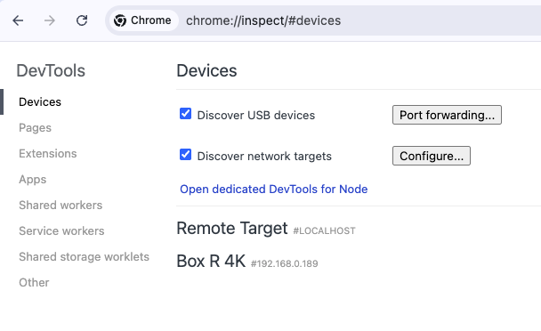
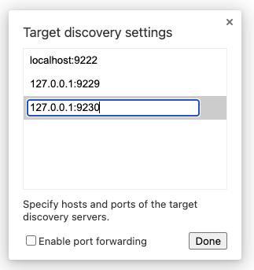
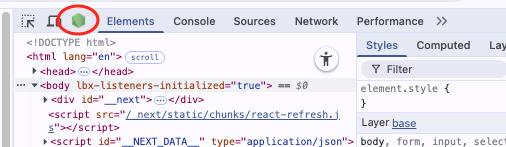
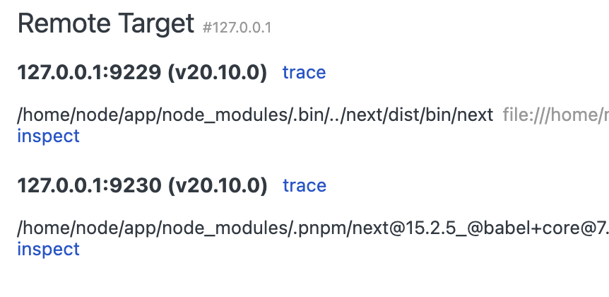

# Chrome DevTools Debugging

This guide explains how to set up and use debugging tools for the Shopsys Platform Storefront application.

## Chrome DevTools Setup

To debug the Storefront application, ensure it is running in Docker. Thanks to the updated npm script:

```json
"dev": "NODE_OPTIONS='--inspect=0.0.0.0:9229' next dev"
```

the Storefront is already running locally in development mode with the Node.js inspector enabled on port 9229. No extra step is needed if you are using the default Docker setup.

### Open Chrome DevTools:

- Open Chrome and navigate to `chrome://inspect/#devices`
- You will see the Devices page:

    

- Click on "Configure..." under "Discover network targets"
- In the popup, add `127.0.0.1:9229` & `127.0.0.1:9230` to the list of targets:

    

### Inspect your application:

- You can open the dedicated DevTools for Node:

    
    - If the icon is not there for some reason open it by clicking on **trace** link of newly added targets under "Remote Target #127.0.0.1":

    

- You can now set breakpoints, inspect variables, and debug your application

## Additional Resources

- [Next.js Debugging Documentation](https://nextjs.org/docs/app/guides/debugging)
- [Chrome DevTools Documentation](https://developer.chrome.com/docs/devtools/)
- [Node.js Inspector Documentation](https://nodejs.org/en/docs/guides/debugging-getting-started/)
